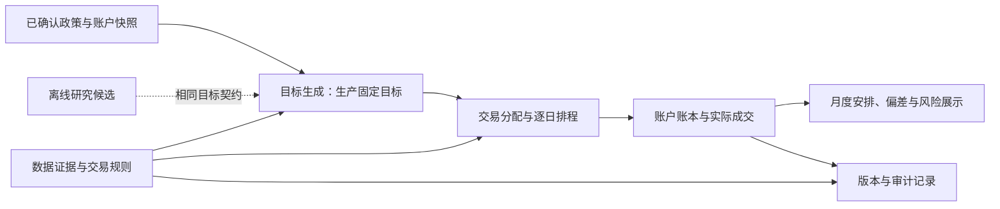

# 月度投资分配系统评审：先确认长期配置，以可执行定投作为生产主线

评审日期：2026-09-19。对应 [EXPERT_REVIEW_BRIEF.md](EXPERT_REVIEW_BRIEF.md)。

**推荐结论：将“所有者确认的类别目标＋新增资金优先＋成本感知再平衡”作为拟议生产主线；Kelly 保留为研究候选。** 原因是它更直接对应家庭月度资金安排，且目前没有独立证据支持战术仓位的额外复杂度。这是基于本项目证据边界的设计判断，不是声称固定配置在未来收益上必胜。

本文是评审建议，尚未批准新的家庭偏好或修改生产默认值。已有产品政策继续有效。数值案例均为明确给定假设的教学账户，不是所有者真实持仓建议；涉及日期、费率及额度均不代表渠道实时状态。

| 性质 | 本次结论 | 后续处理 |
| --- | --- | --- |
| 所有者必须决定 | 长期目标、现金用途、风险取舍、卖出触发与可接受费用 | 先确认政策，再修改默认行为 |
| 可明确修正的契约问题 | 输入权重被静默裁剪／归一化；日期、现金来源及风险对象需要明确 | 独立修复、回归验证，不依赖证明投资超额收益 |
| 需要验证的模型 | Kelly、自动前沿选点、动态目标、替代基金协方差优化 | 冻结比较协议，满足证据要求后再考虑启用 |

评审覆盖 A—H；以下优先讨论 A、B、F，再给出执行模型和迁移安排。

## A．修改目标定义：先解决“如何接近已认可配置”，再研究预测

### 最少输入

| 输入 | 必须程度与单位 | 缺失时如何处理 |
| --- | --- | --- |
| 投资用途、最早可能取款日期、长期持有期限 | 确认新长期目标前必需；日期／年 | 可以维护仍有效的旧目标，不能自动生成“最适合家庭”的新目标 |
| 近期确定支出、应急现金底线及存量现金中允许再投资的金额 | 本月安排必需；元、日期 | 保留原已确认现金政策；未获用途授权的存量现金不追加投资预算 |
| 收入中断时能否继续投入、月投入是否刚性 | 确认新长期目标前必需；情景描述 | 未来投入不视为必然，也不计作当前资产；压力测试加入停止投入情景 |
| 对亏损与目标未达成的取舍 | 确认新长期目标前必需；压力情景下的元／百分比及可承受持续期 | 给出情景供比较，不把历史回撤限值解释成未来保证；未确认则不自动选 Sharpe 最大点 |
| 认可的资产类别、基金映射和长期类别权重 | 目标跟踪必需；权重和为 1 | 使用有效旧政策；否则执行 G 的现金安排，不自动基金等权 |
| 截至明确时间的持仓、已到账现金、待到账款、独立新增资金 | 每月必需；元／份额、时间 | 账目错误拒绝对应计算，列出需修正字段；只继续可独立核实的现金安排 |
| 真实渠道条件 | 对应交易必需；资格、交易日、限额口径、费用、到账条件 | 未知条件的交易只能列为条件计划，不列作已可执行订单 |
| 具体目标购买力金额及日期 | 选择“目标短缺”为主目标时必需；基期人民币、日期 | 普通目标跟踪可不填写；不能输出达标概率 |
| 类别容忍带、最长偏离期、再平衡费用预算 | 启用主动卖出时需要；百分点／月／元 | 保持新增资金改善、显式退出和现金修复；不擅自增设主动卖出阈值 |

不需要每月重新回答长期问题。保存政策版本；每月更新账户、资金、现金用途及变化的交易条件即可。期限、家庭支出、收入稳定性变化时复核目标。

同时确认本工具管理的账户范围，以及账户外负债、应急金和刚性支出是否已另行覆盖。本文“全账户风险”指纳入工具的账户，不代表已经计量房产、负债等全部家庭资产负债风险。

### 推荐的目标与优先级

分两层定义，避免用同一个统计指标代替家庭价值判断。

**长期层：** 所有者确认类别目标 `q_c`，总和为 1。资产类别包括风险资产类别与真实 RiskFree 袖套；Cash 不进入有效前沿。前沿和压力情景辅助解释候选目标。没有期限和风险取舍，不宣称某个点是家庭最优。

如未来明确了目标金额 `G` 与日期 `T`，可研究目标短缺损失：

```text
S = max(G − W_T_real, 0) / G
L_goal = E[S²]
W_T_real = T 时点、完成约定取款后、扣费的账户财富 / 累计物价指数
```

`G > 0`，`L_goal` 无量纲；严重短缺的惩罚比轻微短缺更大。这是拟议效用，必须确认。另报告未达标频率、短缺金额及压力情景，不只报告一个概率。历史不足时不能把重采样频率当作真实未来概率。尚无目标金额时，不部署这层优化，也不默认均值—方差效用系数。

**月度层：** 固定战略目标，优化可执行交易造成的类别偏差。定义：

```text
h_i       当前资产 i 估值（元）
C         已到账 Cash（元）
P         已确认待到账净额（元）；计入财富，不计入可用现金
B         独立新增资金（元），仅在实际到账日进入资金约束
R、Q      必须保留的现金底线、其他已指定用途的现金（互不重叠，元）
W0        期初账户财富 + 已到账新增资金 − 已执行外部取款
A0        max(W0 − R − Q, 0)：本次战略目标的参考资本
b_i       买入毛支出（元）
n_i(b_i)  扣申购费后的净资产增加（元）
s_i       卖出减少的资产价值（元）
V'_c      Σ[i 属于 c] (h_i + n_i(b_i) − s_i)

当 A0 > 0：J = Σ_c [(V'_c − q_c A0) / A0]²
```

这里的类别偏差默认同等计分，是公开的内部启发式，建议先固定、不开放一组调权参数。`A0` 含可配置但尚未投入的资金和相关应收款；应收款的可用时间仍由执行层控制。费用会使最终财富小于参考资本，故参考目标与最终权重都要展示。`A0 = 0` 时跳过权重目标计算，输出现金安排与缺口。

建议采用明确顺序：

1. 遵守资格、真实资金、额度、费用及到账条件；优先修复现金底线。初始已不足时，最小化能在所需日期之前修复的缺口，保留无法修复部分；不能通过声明不可行而终止资金安排。
2. 使用新增资金，以及所有者明确可用的存量现金，生成仅买入方案。按照 `J` 改善类别偏差，不引入收益预测。
3. 只有满足 D 的已认可触发政策，才加入再平衡卖出；优先以最少必要交易回到容忍带，而非每月强求精确权重。
4. 在配置效果相同或仅差金额精度的方案中，依次选费用较低、卖出较少、订单较少的方案；保留确定性排序。

步骤 2 建议不因其他类别限购而主动把某类别买到目标以上；这是**待确认的执行偏好**，不是现金或渠道硬约束。若所有者允许临时超配 RiskFree 或其他认可类别，应明确临时额度与恢复条件，并重新计算最终偏差。可暂存 Cash，无需假设预算必须花完。

本目标并未估计“卖出后能多赚多少钱”。目标偏差与费用之间不可避免的取舍，通过容忍带和卖出费用预算表达；如以后改成 `J + λ × 费用`，必须先说明 `λ` 的效用含义及校准依据。收益、风险、成本分开建模的思路可参考 [Boyd 等的交易优化框架](https://stanford.edu/~boyd/papers/cvx_portfolio.html)，但该论文不提供本家庭的收益预测或效用参数。

### 同一账户，不同偏好的数值结果

共同假设：股票类 A 30,000 元、债券类 B 20,000 元、真实 RiskFree 基金 M 10,000 元、Cash 10,000 元；新增 10,000 元已到账；现金底线 5,000 元；其余存量现金 5,000 元明确可用。没有费用、限额、待到账款及主动卖出。`W0 = 80,000`，`A0 = 75,000`，买入支出最多 15,000 元。

| 假设偏好／类别目标 A:B:M | 目标金额 A／B／M | 本月买入 A／B／M | 执行后 A／B／M／Cash |
| --- | --- | --- | --- |
| 较多安全袖套，30:30:40 | 22,500／22,500／30,000 | 0／0／15,000 | 30,000／20,000／25,000／5,000 |
| 中间示例，40:40:20 | 30,000／30,000／15,000 | 0／10,000／5,000 | 30,000／30,000／15,000／5,000 |
| 较多股票，60:25:15 | 45,000／18,750／11,250 | 14,375／0／625 | 44,375／20,000／10,625／5,000 |

三行都是上述平方偏差目标在本例仅买入条件下的解。第一行实际股票仍为全账户的 37.5%，并未因用户选择更保守目标就立即下降到目标；第三行 A、M 各剩 625 元目标缺口，债券超配 1,250 元。每行均使用全部新增 10,000 元及存量可用现金 5,000 元，费用为零，Cash 留存 5,000 元，无资金失踪。

**内部规则取舍：** 不保留未经确认的统一“单基金最多 50%”作为生产限制。一个宽基基金与多个相似基金，基金数量不能直接代表集中风险。需要的集中度限制应基于类别、穿透暴露或明确基金风险，并由所有者认可。理论目标也不应因小于 1% 被清零；微小交易在执行层按起购额和金额步长处理，余款有明确去向。

## B．默认替换为固定目标；Kelly 暂留研究

### 首选与唯一备选

**首选：** 固定已确认类别目标，月度按 A、D、E 执行。日常界面无需 Kelly 系数、收益估计窗口、均线窗口及两个风险惩罚开关。

**唯一备选：** 将现有 Kelly 路径冻结为研究候选，先修正现金／基准／风险对象的语义，再按 F 比较。不同时引入新的择时家族。当前 36 个月、0.5 系数可以作为带版本号的比较起点，不能称为已经校准的默认最优参数。

经典 Kelly 对重复投资的长期对数增长有明确目标，但有限期限、有新增资金和支出的家庭问题不自动满足相同目标与假设。[Busseti、Ryu、Boyd 的原文](https://stanford.edu/~boyd/papers/pdf/kelly.pdf)明确写出了重复、独立同分布结果等模型条件；其中的风险保证不能转用到本项目的历史软惩罚上。

复杂配置面对估计误差需要承担举证责任。[DeMiguel、Garlappi、Uppal 的论文摘要](https://academic.oup.com/rfs/article-lookup/doi/10.1093/rfs/hhm075)报告，在其 14 个模型、7 个数据集的比较中，复杂方法未一致优于等权。它支持设置简单基线，不证明本项目应采用基金等权，也不证明任何策略必定失败。

### 估计误差的量级

假设月波动 4%、36 个独立月收益，月均值的标准误近似 `4% / √36 = 0.667%`。这只是独立同分布下的说明；实际序列相关、环境变化还会改变误差。

取半 Kelly、月方差 `0.04² = 0.0016`，忽略软惩罚且部署上限为 100%：

| 估计月超额均值 | 未截断比例 `0.5 μ / σ²` | 截断后比例 |
| --- | --- | --- |
| 0% | 0% | 0% |
| 0.3% | 93.75% | 93.75% |
| 0.6% | 187.5% | 100% |

0.3 个百分点的均值变化就显著改变仓位，而它小于这个示例的均值标准误。把求解精度提高到 `1e-8` 不解决此问题。

### 保留研究时的具体规则

- 收益估计只用决策时已发布的完整月份。均值收缩应面向预先声明的长期先验或实际安全资产的超额收益零先验；收缩强度在训练期确定。不能把前沿的横截面收缩直接当成篮子择时均值的校准。
- 窗口 24／36／48／60 个月和系数 0.25／0.5／0.75 只在开发期做完整敏感性比较；报告所有结果与缺失窗口。最终冻结一个候选。更长窗口并非必然更好。
- 研究若要引用“离散对数效用”，应使用 `E[log(1 + r_account)]` 及真实可投资安全袖套、费用和现金；二阶近似只能按近似命名。直接对数效用解决近似误差，不解决预测误差。本轮不为此新增第二套生产算法。
- CVaR 衡量给定期限损失尾部，回撤依赖整条路径，二者不等价；在相同下跌阶段也可能高度相关。建议生产只报告二者，研究先移除叠加的任意软惩罚，隔离 Kelly 自身效果。以后若添加偏好项，一次只验证一项并明确量纲和系数含义。
- 36 个月在 95% 分位的名义尾部只有约 1.8 个观测。21 日滚动窗口相互重叠，不能把重叠数量当成独立样本。尾部不足时显示低置信度、压力情景与数据缺口；不填零，不改成硬否决。CVaR 的场景优化定义可参考 [Rockafellar 与 Uryasev 原文](https://sites.math.washington.edu/~rtr/papers/rtr179-CVaR1.pdf)，其中的可优化性不等于本项目样本足够。

### benchmark、RiskFree、Cash 的处理

若实际持有比例为 `w_i`、`w_M`、`w_C`，不含外部资金流的下一期账户收益为：

```text
r_account = Σ_i w_i r_i + w_M r_M + w_C × 0 − 本期费用影响
```

Cash 始终无收益。RiskFree 使用真实基金回报；只有明确的理论近似才使用设定利率，不能同时叠加真实收益。基准仅用于比较：若基准不随决策变化，最大化 `E[log(W_T / Benchmark_T)]` 与最大化 `E[log W_T]` 的最优决策相同。

当前 [strategy.py](backend/core/strategy.py) 用历史均值减传入的 benchmark rate 决定比例，但风险场景中的剩余仓位是零收益现金。这会改变策略：上例历史均值 0.3%，减去 0.1% 月基准后，半 Kelly 从 93.75% 变为 62.5%。只有剩余资金实际投向相应安全资产、并同时在财富方程中计入其收益时，这种机会收益扣减才有对应含义。否则应移出配置目标，保留为比较指标。

验收应加入一个不依赖市场表现的检查：只修改展示比较基准，真实账户政策与交易不应随之变化。涉及模型行为的修改应先在研究版本验证，不能只靠修改参数名称完成。

## F．先冻结验证协议，再决定复杂方法是否值得保留

### 截点与基线

截至本次评审，最新可用的完整月度信号月份至多是 **2026-08**；9 月可用日度数据必须按真实发布时间截断。抓取时间、估值日期和可得时间分别保存。

必须比较以下基线，并保证费用、申购日期、现金用途、初始账户、新增资金与取款完全一致：

| 编号 | 基线 | 回答的问题 |
| --- | --- | --- |
| B0 | 固定认可类别目标，新增资金按目标比例投入，不择时 | 最简单的定投有多好 |
| B1 | 同一目标，新增资金按类别缺口投入，仅买入 | 调整资金去向本身有何贡献 |
| B2 | 同一目标，增加认可的低换手再平衡政策 | **主要生产比较对象**；复杂方法能否优于完整的简单执行政策 |
| B3 | 认可类别等权，类内按已确认映射配置 | 诊断目标估计价值；不是自动替代用户目标 |

按基金等权会受同类基金数量影响。一次性投入若把尚未赚到的未来新增资金提前投入，不是公平基线；只有对期初已经可用的一笔资金，才可另做一次性与分批比较。

比较 Kelly 时先固定目标；比较动态目标时先关闭择时。最终策略组合仍需对 B2 单独验收，不能把各模块的单独提升直接相加。

### 可转成脚本的时间协议

1. 冻结认可资产集合、类别、份额类别、替代关系、费用与可购数据来源；记录代码及原始数据哈希。今天选择的基金回放过去，只能称为“当前集合的条件历史比较”，不能声称不存在幸存者或选品偏差。
2. 对 36 个月窗口，建议筛查规模为 **36 个月收益训练＋24 个月滚动选择＋36 个月未使用最终评估**，共 96 个月有效收益观测，且每段需要相应端点价格。窗口比较必须用最长窗口统一预热和相同评估起止；纳入 60 个月窗口时，按此设计至少需要 60＋24＋36＝120 个月。它们是治理上的筛查规模，不是统计功效结论。数据不够的配置记为不可评估，不能填代理后冒称原基金记录。
3. 每个决定只使用 `available_at <= decision_at` 的信息；订单在之后真实允许的交易事件执行。不能以月末收盘信号回填同一已结束估值时点的成交价。
4. 最终评估只留一个冻结候选。允许算法按已冻结规则利用过去数据更新估计，但禁止根据评估结果重新选参数、指标或基金。所有尝试、淘汰和失败均进入实验登记。
5. 已用于开发、调参或人工选方案的历史，永久标记为开发证据。简报所述 2023 年以来的链路核验不能再被命名成独立留出期。没有真正未使用的历史，就前瞻纸面运行；不通过切分图表制造独立性。

反复选策略会产生选择偏差，单个漂亮回测或名义显著性不能消除这个问题。[Bailey 等的回测过拟合研究](https://www.davidhbailey.com/dhbpapers/backtest-prob.pdf)对此提出了专门诊断。PBO／Deflated Sharpe 可作为额外研究诊断，不能代替真实时间可得性和前瞻冻结。

### 首要指标与可接受劣化

所有者确认目标前，**建议**首要指标为同一资金流下的费后实际终值差：

```text
ΔW = W_T_complex_real − W_T_B2_real                    单位：基期人民币元
H = 年数 × (额外维护小时/年 × 时间价值/小时 + 执行成本不确定额/年)
```

期末总财富包含基金、RiskFree、Cash 和已确认应收款；另外列示“截至支出日期能到账的金额”。长期目标金额确认后，可以在看测试结果前改用 A 的短缺损失作为首要指标；不能在看到结果之后从终值、Sharpe、回撤中挑获胜指标。

实际购买力需要指定同一物价序列及基期；序列缺失时只报告名义元，不能把它标成实际终值。外部新增、取款及期初持仓按同一真实时点进入各策略，不因某策略延迟投资就延迟记录新增。管理费等已体现在基金净值中的费用不重复扣除；历史渠道条件缺失时标记执行假设，并报告可核实上下界，不宣称精确可交易历史。

**阈值示例，需确认：** 额外维护 6 小时／年、时间价值 100 元／小时、执行费用不确定额 100 元／年，得到 `H = 700 元／年`，36 个月为 **2,100 元**。对 20 万元参考资本，约相当于 35 bp／年的成本量级；这不是预测年化超额收益，也不是文献推荐阈值。已计入回测的交易费不能再放进这 100 元重复计算。

| 验收维度 | 拟议门槛 | 依据及失败处理 |
| --- | --- | --- |
| 资金与执行正确 | 每个事件现金账精确到分，无借用未到账款、超额申购或无解释的资金；已知现金短缺不被交易扩大 | 会计与真实执行条件；失败必须修复，不涉及风险偏好选择 |
| 经济改善 | 最终独立评估 `ΔW > H` | 用家庭维护成本表达复杂度门槛；`H` 需所有者确认 |
| 不确定性 | 预声明的成对区块重采样诊断，其单侧下界在各指定块长下仍大于 `H`；否则仅保留实验地位 | 保守筛查规则，不是对未来收益的置信保证 |
| 风险劣化 | 示例：账户回撤较 B2 多不超过 2 个百分点，21 交易日 CVaR 多不超过 1 个百分点 | 待确认的偏好；20 万元静态财富分别对应约 4,000／2,000 元额外损失量级。门槛约束模型晋级，不能取消当月资金方案 |
| 稳定性 | 开发期参数扰动、费用翻倍、到账延迟和压力情景全部披露；邻近参数若从改善翻为重大劣化则暂不晋级 | 防止只依赖一个幸运设置；“重大”采用同一已确认风险／成本容忍度 |
| 操作成本 | 真实纸面操作记录的额外维护成本不超过上述计价假设 | 记录订单数、补数据时间和人工修改，不能只看计算耗时 |

区块诊断建议固定种子 `20260919`、2,000 次，块长 3／6／12 个月，同月各策略的**费后账户收益成对**抽样，再以同一冻结资金流计算终值。它只描述已实现策略收益序列及依赖假设下的条件不确定性；不等于策略在重组市场上重新交易。真正的市场压力回放应输入联合资产路径并重跑完整策略。重叠滚动终值不能当作独立家庭样本。只有 36 个月评估时，12 个月块能提供的信息很少，应明确显示区间不稳定。

实现诊断时，固定每月期初投入、期末取款的示例可用 `W_t=(W_(t−1)+B_t)(1+r_t)−D_t`；真实资金流发生在月内时需使用相应事件子期收益，不能直接套用该式。风险门槛需要的日度数据或有效尾部不足时，结果为“证据不足”；不能把 null 当成零，也不能为让候选晋级而临时删除门槛。历史区间还应按预先指定的类别基准，覆盖上涨、下跌／恢复、股票债券同跌等阶段；缺失阶段使用显式压力情景，并承认它不增加独立历史样本。

预设单侧显著性筛查水平为 5%，是研究治理选择。若最终评估实际查看了 `K` 个候选，采用至少 `0.05/K` 的保守多重比较控制；尝试记录不全则不作“已校正显著”结论。调参发生在独立选择期也必须记录，但不能靠这些校正补救已泄漏的留出期。

次要指标包括费后 TWR、保留正负方向的 XIRR、账户单位净值回撤、CVaR 及有效样本数、费用／换手、偏差、非保留现金占用天数、未满足取款和人工时间。TWR 剔除外部资金流对收益率的机械影响；MWR／XIRR 反映资金大小与时点，二者用途不同，参见 [GIPS 的计算说明](https://www.gipsstandards.org/standards/gips-standards-for-firms/gips-standards-handbook-for-firms/)。这里只借鉴定义，不声称系统符合 GIPS。资金流有多次符号变化时，XIRR 可能多根或无根，不能作为唯一排名指标。

### 历史不够时的上线／保留／淘汰

- 立即继续使用可核实、已确认的月度政策；统计证据不足不阻止资金安排。
- 候选冻结后，从之后首个确认的执行日开始纸面记录。3 个完整月检查执行流程，12 个月作首次前瞻复核；二者均不证明长期超额收益。未满足最终证据条件则继续实验，不自动转默认。
- 每季度核对运行与数据质量；经济评估只在预先登记的时点做。发现计算错误可以立即修复，但新版本另记证据起点，不把旧版结果拼成新版独立表现。
- 完成一次预声明的最终评估仍未超过成本门槛，停止主动维护该候选，将代码及结果归档。证据不足与已证实劣化分别记录；不因短期落后临时改规则，也不无限调参保住候选。

机器可读提案见 [验证协议 JSON](analysis/expert_review_validation_protocol.json)。其中 `enable_production_strategy=false`，偏好和门槛仍待确认；它是协议配置，不是已完成历史验证的结果。

## C．统一变量：类别目标属于配置资本，风险报告属于真实账户

**推荐修改，保留分层。** 长期目标由政策确定，月度规划从实际持仓出发；研究战术层可插拔。不要把长期目标、战术变量和本月成交后比例都命名为 `target_ratio`。

| 变量 | 明确语义 |
| --- | --- |
| `strategic_class_weights` | `q_c`，相对于 A 的长期类别权重，不包括保留 Cash |
| `tactical_scale` | `τ`，相对战略风险资产目标的缩放倍数；生产固定目标为 1 |
| `effective_target_amounts` | 从 `q`、`τ`、A 计算的目标金额，附未投资部分的目标去向 |
| `planned_trades` | 带日期／触发条件、费用与资金来源的交易计划 |
| `projected_account` | 对计划执行的估算账户，按费用、限额及到账分别计算 |
| `observed_account` | 用户或成交记录确认的实际账户；下月以此为准 |

研究若保留 `τ`，风险资产绝对账户比例应为 `τ × q_risk × A / W`。例如 W 为 100,000 元、保留 Cash 10,000 元，A 为 90,000 元，战略风险资产 60%、RiskFree 40%、`τ=0.5`：目标风险资产 27,000 元、RiskFree 36,000 元、Cash 37,000 元。这里明确假设战术减少部分暂存 Cash。风险函数应计算这三个金额，不能再用“50% 风险篮子＋50% Cash”代表它。若战术释放资金改投 RiskFree，必须显式更改政策与收益方程。

避免在战术层和执行层对同一个现金底线重复扣减。长期目标保留原值；执行层单独报告现金储备、资金受限导致的目标差距。限购使实际风险高于目标时，继续给出可行买入／暂存／卖出安排，并展示改善量和剩余偏差。

### 同时包含持仓、限购、费用、RiskFree 和 Cash 的完整案例

沿用 A 的期初账户与资金，但本例战略目标为 A:B:M = **30:50:20**，无战术缩放、无主动卖出。以下条件全部为给定假设：

- 计划日为 2026-09-21、2026-09-22，假设渠道已确认两天可申购。
- B 每日剩余毛额限额 3,030 元，两天无其他订单；外扣法申购费率 1%，故每笔净申购 3,000 元、费用 30 元。
- M 是已认可的真实 RiskFree 基金，费率为零，本例不超过类别目标；可以申购 5,000 元。A 持有不动。
- 为核对交易账，本例假设确认价格不变、上述买入已确认；实际产品应把未来估值和份额列为估算，成交后按确认值重算。

| 账户行 | 期初 | 长期目标金额 | 本月安排 | 费用 | 执行后 | 全账户实际权重 |
| --- | ---: | ---: | --- | ---: | ---: | ---: |
| 股票类 A | 30,000 | 22,500 | 持有；无新增买入 | 0 | 30,000 | 37.5281% |
| 债券类 B | 20,000 | 37,500 | 两日各支出 3,030，合计净增加 6,000 | 60 | 26,000 | 32.5244% |
| RiskFree 基金 M | 10,000 | 15,000 | 9 月 21 日买入 5,000 | 0 | 15,000 | 18.7641% |
| Cash | 10,000 | 5,000 | 新增资金到账 10,000；买入支出 11,060 | — | 8,940 | 11.1834% |
| 待到账款 | 0 | — | 本例无卖出 | — | 0 | — |

目标金额以交易前 `W0=80,000、A0=75,000` 为基准。资金对账：

```text
70,000 期初财富 + 10,000 新增 = 79,940 执行后财富 + 60 费用
20,000 到账后 Cash − 6,060 B 毛支出 − 5,000 M 毛支出 = 8,940 Cash
新增 10,000 全部使用；动用存量可用现金 1,060；存量现金剩余 8,940
8,940 = 5,000 现金底线 + 3,940 等待后续可购日期的现金
```

相对于原目标，A 超配 7,500 元、B 少配 11,500 元、M 恰达目标；余款 3,940 元不够消除偏差，且本月已确认的 B 额度用尽。暂存位置为原 Cash 账户。后续触发为新的已确认购买日及剩余额度，或下月更新账户，以先发生者重新评估；不预订未知的第三个交易日。

若按最终资本 `A'=79,940−5,000=74,940` 展示相同政策的对应金额，则为 22,482／37,470／14,988 元；原目标和费后重算口径同时标清，避免把费用造成的微小差异视为交易错误。

设一个**没有概率含义**的联合压力情景：A 下跌 30%、B 下跌 8%、M 下跌 1%、Cash 不变。执行后损失为 `9,000+2,080+150=11,230 元`，占 79,940 元的 **14.0480%**。原战略账户相同情景损失为 `6,750+3,000+150=9,900 元`，占 80,000 元的 **12.3750%**。实际账户风险仍高于目标，原因是 A 存量超配及 B 限购；不能拿参考篮子风险掩盖，也不应撤销这份月度方案。

RiskFree 的近似零方差只用于明确标注的理论模型。真实报告保留基金的实际收益、波动、信用／流动性压力、额度和赎回条件；普通低波动债基不能仅凭名称被设成零风险。Cash 不附加收益。待到账款在财富和流动性桥接表里单列，不变成新的投资类别。

## D．修改现金与卖出规则：现金用途明确，卖出以修复偏差为目的

建议保留一个 Cash 总余额，并附用途记录：现金底线、其他已指定用途／等待交易的资金、允许再投资的金额。三类金额不重复相加；“等待某笔订单”是 Cash 的占用状态，不是额外资产。每月最少确认总现金、底线和**本月可动用的存量现金上限**；用途没有变化时沿用已有版本。

卖出触发建议结合容忍带与预计修复时间：

```text
先生成仅买入方案。
若仍偏离认可容忍带，估算在市场不变、按保守投入计划下回到带内需多少个月。
只有超过所有者容忍时间，或出现明确退出／现金修复需要，才提出卖出。
在能够按需到账、允许赎回且费用不超过认可预算的方案中，
选择回到容忍带所需的最小卖出，通常不追求立即回到精确目标。
```

该修复月数是条件测算，不是预测。未来投入不确定时应报告停止投入情景；不能据假定收入永久推迟必要修复。成交后反向交易和同基金同日买卖应被明确净额处理，避免机械换手。

这一思路与以配置偏差、交易成本共同确定再平衡范围的实践一致。例如 [Vanguard 的再平衡研究说明](https://workplace.vanguard.com/insights-and-research/perspective/portfolio-rebalancing-navigating-volatility-in-vanguard-target-retirement-funds.html)采用触发边界和回归边界区分来减少交易；其机构组合的数值不能直接移植为中国个人基金账户的阈值。

### 30,000 元现金、20,000 元底线、5,000 元新增的三种安排

补齐题目缺失的共同假设：股票 A 65,000 元，债券 B 35,000 元；长期配置 A:B=50:50。投资资产中 A 起初占 65%，超配 **15 个百分点**。Cash 30,000 元中，20,000 为底线，10,000 已指定为近期支出，不能投资。新增 5,000 已到账，B 无申购费／限购。

本例所有者假设认可：类别容忍带 ±5 个百分点、等待上限 2 个月、主动再平衡费用上限 50 元。本组数字只是演示如何表达偏好，不能直接写进默认参数。

先把新增 5,000 买入 B：投资资产变成 105,000，A 比例 61.9048%，仍比 50% 目标高 11.9048 个百分点。市场不变、以后每月新增 5,000 全买 B 时，回到 55% 上沿需要：

```text
ceil[(65,000 / 55% − 105,000) / 5,000] = 3 个未来月份
回到精确 50% 则需要 5 个未来月份
```

| 情景 | 明确安排与理由 | 本月执行后（A／B／Cash／待到账） |
| --- | --- | --- |
| 零赎回费，卖出款在后续买入前已确认到账 | 卖 A 7,250，新增与卖出款合计买 B 12,250；回到 55% 上沿，费用零 | 57,750／47,250／30,000／0 |
| 赎回费 2%，其他条件相同 | 本月仅买 B 5,000。修复到 55% 需卖约 7,330.64，费用 146.61，超过本例认可的 50 元预算；不执行该卖出 | 65,000／40,000／30,000／0 |
| 零赎回费，给定卖出已确认、净款预计 2026-10-09 才到账 | 本月卖 A 7,250、只用新增买 B 5,000；7,250 单列待到账。到账后核验账户及 B 资格，再条件买入 7,250 | 57,750／40,000／30,000／7,250 |

高费率情景的精确计算考虑费用会减少分母：

```text
(65,000 − s) / (105,000 − 0.02s) = 0.55
s = 7,250 / 0.989 = 7,330.637… 元
```

本例按金额向上取分为 7,330.64，费用四舍五入为 146.61；实际基金按可赎回份额、确认净值和渠道规则计算。该高费卖出只是用于比较，不计入实际方案的费用。高费方案下月复核，或在已知费率降低时复核；仍保留约 3 个月条件修复路径。

三行当月新增 5,000 元均有去向，Cash 30,000 元中的两项保留用途均完整。慢到账方案仍有约束未完成，不能把未来条件买入算成本月已成交。

如果那 10,000 元没有支出用途，且所有者明确同意本月投入，先合计买 B 15,000 元；投资资本变为 115,000，回到 55% 上沿的零费卖出降为 **1,750 元**。因此“现金超过底线”本身不足以推出卖出或投资金额。

### 现金底线不足时

先用已到账新增补缺口；然后按**能否在需要时到账、能否赎回、净到账额和费用**选资产。RiskFree 优先只能作为条件相同的排序偏好。例如 Cash 12,000、新增 5,000、底线 20,000，仍缺 3,000；若需要今天修复而 M 只能两天后到账，不能因为名为 RiskFree 就认定今天能补足。存在当天实际可到账的合格赎回渠道时比较其成本；没有则保留 3,000 缺口和后续到账计划，暂停占用底线的买入。

## E．先采用连续分配与确定性排程，保留离散约束的真实语义

**推荐修改，不立即引入完整多期混合整数优化。** 少量基金、每月人工执行，先用连续问题产生金额上界，再按已知日期、起购额、费用及资金到达顺序排程；最终结果要在真实离散条件下重新验证。连续解的求解成功不等于排程全局最优。

### 最小数据结构

| 记录 | 最小字段 |
| --- | --- |
| `AccountSnapshot` | 截点、币种、逐只基金金额／已确认份额／估值时间，Cash 总额、用途占用、待到账款，外部新增及取款事件 ID |
| `AssetDefinition` | 真实基金及份额类别、风险资产／RiskFree 分类、类别暴露映射、渠道、认可替代关系、证据来源 |
| `HoldingLot`（需要卖出时） | 基金及份额类别、确认买入日期、剩余可赎回份额、锁定截止、份额扣减顺序、费用档位依据 |
| `DealingRule` | 开放日期与截止时间／时区、估值日与确认日规则、日／月／共享额度、已用及已预占额度、金额口径、起购额、步长、费用函数、生效日、来源及核验时间 |
| `OrderPlan` | 订单 ID、基金／渠道、买卖方向、申购毛额或赎回份额、计划日或触发条件、预计净额／费用、资金来源 ID、确认／到账条件、状态 |
| `Receivable` | 对应卖出／分红事件 ID、预计或已确认净额、最早／预期到账日、到账凭证、是否已释放为 Cash |
| `CorporateAction` | 事件 ID、币种、每份分红／拆分口径、权益条件、登记日、除息日、支付日、再投资定价日与确认日、官方依据 |
| `PolicyVersion` | 确认目标、权重分母、现金用途及卖出政策、允许替代、失效／复核条件、所有者确认记录 |

只维护买入与估值时不必要求完整历史交易批次。需要按持有期计算赎回费时，必须取得足以确定费率的批次或渠道费用预估。没有日期但已知适用费率区间，可以列出费用上下界、按可靠上界检查资金可行性，并把精确卖出标记为待核验；上界也未知时不能捏造精确净到账款。持有期起算与份额扣减顺序应采用基金／渠道规则，不假设所有基金都适用同一 FIFO 规则。

金额预览与真实份额确认分开：申购毛额可以先确定，未来净值和份额通常不能。待确认申购、赎回及分红期间也须避免资产或现金双计。

### 分配与排程步骤

1. 核对账户与独立资金流；校验目标范围、负数和权重和。以真实购买日集合建立逐日额度，扣除当日已用和已预占金额，共享额度按共享范围扣减。
2. 用这些日期的剩余额度给月度分配提供上界。目标来自战略层；连续分配已经感知可执行额度及费用，不先假设所有钱都能买入再被动删单。
3. 按先到的可用资金及日期排程；每笔重新计算分笔费率、起购额与步长。不同日期的额度不能互借，当月额度不能跨月沿用。
4. 向下取整后，回收未使用资金，再寻找能改善目标偏差的合格增量。增量必须是完整可执行订单或现有订单的有效增加，不能把不足起购额的零头强行买入。
5. 输出各日期的现金路径、资产确认状态、已到账／待到账卖出款，以及每一笔尚未执行资金的金额和触发条件。按真实限制复核；失败时保留诊断，并执行确定性备用安排。

现金事件至少满足：

```text
C_after(d) = C_before(d) + 当日到账新增 + 当日实际到账净卖出／分红
             − 当日买入毛支出 − 当日外部取款
```

另维护未到账应收款，不进入上式的可用资金部分。已有现金底线缺口必须显示每日尚缺金额；“预计月底够钱”不能替代支出日的流动性。

### 205 元、两天额度的可复算批次

输入明确为：2026-09-21、2026-09-22 **两天在本情景中已确认可买**；预算 205 元于第一天前到账；每笔最低毛额 10 元，毛额步长 0.01 元；每日毛额上限 100 元，已用额度均为零；没有其他月限额；本例费用为零。独立现金底线已另外满足。

| 日期 | 毛支出 | 费用 | 净资产增加 | 剩余待安排 Cash |
| --- | ---: | ---: | ---: | ---: |
| 2026-09-21 | 100 | 0 | 100 | 105 |
| 2026-09-22 | 100 | 0 | 100 | 5 |

5 元保留在原 Cash 账户。下一次已确认可购买日，若没有新增资金凑足 10 元，仍不能下单；下月到账后合并评估。不能生成“第三笔 5 元”，也不能把两天解释成任意两个工作日。

若输入改为外扣法申购费 **1%**，每日限制仍按毛支出计，则两笔仍各支出 100 元，每笔净额按分四舍五入为 99.01、费用 0.99：总净增加 **198.02**、费用 **1.98**、Cash **5**。若限额改按净额 100 元计，则两笔各毛支出 **101**、净增加 **100**、费用 **1**，Cash 留 **3**。费用与限额口径必须同时进入排程；不能仅在结果表末尾扣一次总费用。

当固定分笔费用、持有期跨档、共享限额、互斥订单或多笔起购额导致连续＋排程反复遗漏有意义的可行方案时，再引入小规模订单枚举或整数变量。验收依据是可展示的反例、可改善金额和维护成本；不是因为数学模型表达力更强就全面改写。多期预测收益优化还需要额外预测证据，应与确定性交易日排程区分。

### QDII 与分红回放

至少收集基金合同／更新招募说明书、对应事件的基金管理人公告、渠道确认／到账规则，以及账户采用现金分红还是红利再投资的设置。保留估值时区、境内外休市日、份额类别与币种；申购资格公告不能替代个人渠道剩余额度。

不能统一检查“登记日必须早于除息日”。一个可直接核对的例子是 [广发美国房地产指数基金 2025-01-10 分红公告](https://www.gffunds.com.cn/jjgg/zdsj/202501/t20250110_403586.shtml)：登记日为 **2025-01-14**，场外除息日为 **2025-01-13**，现金发放日为 **2025-01-15**，再投资采用 1 月 13 日对应币种净值。它说明需要按具体公告处理，不意味着其他基金采用同一顺序。

研究总收益指数可按明确的再投资约定构造；真实账户则按实际权益、支付／确认时间处理。仅知道现金支付日，不足以反推除息日或再投资份额。缺失这些资料时，可以保留已确认目标的月度安排，但暂停依赖精确事件权益的账户回放。

## G．按数据状态降级，不让基金数量决定家庭配置

**推荐修改当前备用次序。** 顺序为：仍适用的已确认目标 → 已确认的长期类别目标及认可映射 → **预先认可**的类别等权或其他备用政策 → 补足现金／有条件的已认可 RiskFree 暂存 → 明确保留 Cash。基金等权与最低波动组合不能作为未经确认的自动新目标。

| 数据状态 | 允许的计算 | 本月资金安排与说明 | 恢复条件 |
| --- | --- | --- | --- |
| 账户、交易条件、收益证据完整，目标有效 | 目标跟踪、账户风险和对应精度的回放；研究候选仍受 F 限制 | 输出标准方案，分开显示长期与实际配置 | 常规更新 |
| 部分基金历史短、总收益不足，但当前金额与交易条件可靠 | 保留全部持仓；按有效目标作金额规划，缺失风险指标为 null | 限定在认可标的及明确条件内交易；注明目标维护方案，非新统计最优 | 补齐可核验收益或获准使用指定代理 |
| 现金／分红或再投资事件不完整，但当前账户可核实 | 当前计划仍可算；暂停依赖事件细节的精确账户回放 | 继续有效目标与合法资金安排，不伪造确认份额 | 管理人公告、渠道记录及账户权益对账 |
| 协方差不可估、求解失败或无研究候选通过 | 不产生新的最优目标，保留诊断 | 沿用有效目标，按确定性类别缺口及认可替代执行；剩余 Cash 单列 | 数据恢复、求解修复；新模型仍须验证 |
| 无已确认目标，或旧目标因家庭用途／资产集合变化失效 | 只做可独立核实的现金及约束计算 | 先补现金底线；其余暂存在原 Cash 账户，列明金额；只有已有认可规则才能买 RiskFree | 所有者确认目标或备用政策；最迟下次月度决策复核 |
| 所有投资标的暂停申购 | 持仓估值及现金规划，允许的赎回另行检查 | 所有新增先满足现金用途，其余在 Cash 等待；仅按已认可且实际可买的替代安排重新分配 | 限购解除、新的可购买日期／替代资格确认 |
| 数值非法、权重冲突、资金重复计入或账目不一致 | 拒绝受影响的组合计算 | 明确列出字段、输入值及修复步骤；金额本身无法核实时不输出虚构交易 | 用户修正并对账通过 |

类别等权也不是没有风险偏好的选择：股票、债券、商品各一份与各占多少风险不同。因此它需要预先认可；缺失认可时保留 Cash 比擅自改家庭目标更符合产品边界。保留方案应注明“因目标未确认暂存 X 元”，及确认政策／下次月度更新的触发条件。

代理或共同窗口仅用于明确标注的估计：

- 代理必须提前指定指数、币种、总收益／价格口径、费用差异、起止日期和暴露差异；不在看到结果后挑相关性最高的指数。
- 共同窗口仍覆盖所有要估计的资产；若不足，降低结论强度或暂停估计。不得悄悄删除短历史基金、补零收益或重归一化剩余权重。
- 可做“基于代理的类别研究”，不能称为原基金可交易回测；精确限额、费用和分红回放仍需要对应基金与渠道历史。
- 单一供应方内部对账支持一致性，不能证明事实完整。抽核基金管理人的净值／分红公告、登记确认资料或独立生产数据源；同一上游数据的另一个接口不算独立证据。
- 研究依赖可比较的总收益、币种、时间可得性及样本边界；精确交易回放还依赖批次费率、权益记录、真实可购买日和确认日期。区分两类证据缺口，避免“一只基金某个确认日未知”无条件阻断全部月度规划。

已确认目标至少保存：政策 ID／版本、确认人及日期、投资用途／期限、类别权重及分母、基金与替代映射、Cash 用途、卖出与费用政策、数据依据、复核日及失效条件。建议年度提醒复核；提醒到期本身不自动使目标失效。家庭支出、现金需求、认可资产或风险承受发生实质变化时，需要新确认；确认前按已认可的临时政策处理。

## H．保留一条生产主线，研究通过相同契约比较

建议模块边界如下；保留现有 FastAPI、React 和账本，不更换技术栈：



### 输入输出契约与删减范围

| 保留 | 精简或迁移 |
| --- | --- |
| 一个确认目标入口；输入真实持仓、独立 Cash 和新增资金 | 日常使用不强制先跑前沿或回测；取消隐式自动选最高研究评分点 |
| `plan_month` 共用入口、现金／费用计算、账本与审计 | 通过结果契约共享，不在 API／展示组件再推导一套资金去向 |
| 真实 RiskFree 资产及收益、独立 Cash、事件应收款 | 用资产元数据和真实代码表达袖套；显式迁移旧合成 `RiskFree`，不能靠名称猜类别或静默转换余额 |
| 一个确定性备用分配器 | 不用多个研究备用候选替代一个默认月度方案；认可替代不应仅因缺协方差就完全无法参与确定性规划 |
| 独立市场数据证据、实际确认交易与版本日志 | 研究模块按需运行，前沿、Kelly 窗口选择、协方差消融移至研究入口／脚本 |
| 最小必要的策略适配接口 | 在查清调用方并迁移后，删除 `legacy_linear`、已废弃 `max_buy_multiplier`／`sell_threshold`、重复比例别名及无消费者字段 |
| 理论风险、计划风险与实际风险各自标明对象 | 迁移 `enable_*_constraint`、`max_feasible_ratio_by_*` 等已不表示风险硬约束的旧字段，避免语义误导 |

关键契约必须包含：账户截点与数据可得时间、目标权重分母与政策来源、订单状态和可执行日期、费用／额度口径、资金来源与应收款关联 ID、现金缺口、未知字段、备用原因、求解质量、算法／输入／数据哈希。求解器返回“成功”不能代替执行层的独立验证。

### 三个可独立验收的迁移阶段

| 阶段 | 内容 | 完成条件 |
| --- | --- | --- |
| 1：契约与政策基座 | 明确并修正权重输入；保存确认目标及 Cash 用途；区分理论、计划和实际账户；给现有行为标明证据等级 | 输入错误显式拒绝；账户资金与目标能复现；所有者未确认的偏好没有被自动写为默认 |
| 2：可执行生产流程 | 所有者确认后采用固定目标主线；加入有日期的额度、费用／到账、必要批次及 D 的卖出规则；完善确定性降级与展示 | 简报全部验收场景都有金额去向、约束状态、执行日期／条件；回测与建议共享语义；人工结果可更新下月账户 |
| 3：研究隔离与删除 | 冻结 F 协议，迁移研究模块；记录调用方并移除无用途兼容分支；保留旧版本回放适配 | 生产无研究模块也能给方案；研究候选使用同一执行器；删除项无活动调用且旧审计可识别版本 |

阶段 2 的目标或卖出政策需要所有者决定。阶段 1 的明确契约修复和证据分层无需等到复杂策略证明有效。全文不要求先完成研究系统再使用月度方案。

## 本次代码核对与复算证据

评审基于工作区当前文件，Git HEAD 为 `88849b2506e068b8c7b013e299616b7f01e743b0`，**工作区已有大量未提交修改，HEAD 本身不代表本次全部实现**。本次保留这些修改，仅新增评审文档、独立算例脚本和验证协议。未重新下载真实基金数据，未执行新的独立历史绩效验收。

| 已核对事项 | 代码／结果 | 判断 |
| --- | --- | --- |
| 默认策略及内部权重阈值 | [constants.py](backend/core/constants.py)：`optimized_kelly`、36 月、0.5、单基金 50%、微小权重 1% | 与简报描述一致；生产去留需按 A、B 分开决定 |
| 权重非法输入静默改变 | [portfolio.py](backend/core/portfolio.py)：`normalize_weights`／`validate_weight_universe` | **已复现契约问题**：`{A:1,B:-0.2}` 被接受为 `{A:1,B:0}`；`{A:0.6,B:0.2}` 被改为 `{A:0.75,B:0.25}`；负权重的范围外资产也未被拒绝 |
| 战术与最终风险对象不同 | [strategy.py](backend/core/strategy.py)、[decision.py](backend/core/decision.py) | 前者用参考篮子求比例，后者再乘战略比例和处理 Cash；需要 C 的统一变量和实际账户风险 |
| 购买天数仍非实际日期 | [limits.py](backend/core/limits.py) | 两天计划会产生两倍日限额上界；这是金额容量估计，不足以证明两张实际订单可执行 |
| 费用与可用资金语义 | [execution.py](backend/core/execution.py)、[ledger.py](backend/core/ledger.py) | 已有毛／净额及待到账分离基础；全局 `reuse_settled_sale_proceeds` 尚不能表达逐笔到账时间 |
| 研究比较边界 | [walk_forward.py](backend/core/walk_forward.py) | 有动态／固定／无 Kelly 比较，但不等于冻结独立验收；固定权重目前可来自首期训练选点，须与所有者固定目标基线区分 |
| 资金流扩展注意事项 | [performance.py](backend/core/performance.py) | 现有贡献汇总将金额转为 `-abs(amount)`；未来加入取款时必须改为使用保留正负方向的完整事件流，不能直接沿用 |

权重修复建议：公开 API 接收已定义的权重，检查所有资产、所有符号及权重和；仅为浮点误差设很小的公开容差，容差外拒绝。若要支持“比例分数”输入，应另设明确字段／模式，并展示用户确认后的转换，不能与权重输入混用。此处已定位问题，尚未在本次评审中修改生产代码。

本次运行：

```bash
cd backend
.venv/bin/python -m pytest tests/test_monthly_policy.py \
  tests/test_independent_backtest_oracle.py \
  tests/test_framework_contracts.py tests/test_risk_frequency.py -q
```

结果：**43 passed**；有一个既有 `pkg_resources` 弃用提示。这是相关工程行为的验证，没有证明策略投资效果。未重跑完整后端、前端测试或真实市场数据链路。

数值案例使用独立标准库脚本复算，不调用生产规划器：

```bash
python analysis/expert_review_examples.py
```

[算例脚本](analysis/expert_review_examples.py)检查 A 的平方偏差解条件，以及 C、D、E 的费用、现金和待到账财富守恒，并输出 B 的估计误差示例和 F 的成本门槛。所有输入均在脚本中公开。协议 JSON 和算例可复算，不代表家庭政策已批准。

新文件另做 JSON 解析、本地链接、空白与文件结束格式检查；算例脚本使用仓库配置版本 Ruff 0.14.10 检查和格式化。没有对已有未提交文件执行自动格式修改。

## 需要所有者一次性确认的决策

1. 资金用途、投资期限／最早取款日期，以及希望用“长期配置维护”还是明确目标金额的短缺作为主要决策依据。
2. 认可的类别目标和压力情景取舍；若尚无目标，先保留仍有效的旧政策或明确暂存安排。
3. 存量现金中可再投资的额度，目标受限时能否临时超配认可类别／RiskFree，以及临时安排的恢复条件。
4. 主动卖出的容忍带、最长等待时间、费用预算；D 中的 ±5 个百分点、2 个月、50 元仅为案例。
5. 是否接受拟议固定目标生产主线，以及研究候选的成本和风险晋级门槛；F 中 2,100 元及风险劣化界限仅为提案。

这些决定可以形成一份简短的家庭投资政策。计算契约修复、模型有效性验证和个人价值取舍分别推进，避免在代码默认值里替所有者完成未作出的选择。
