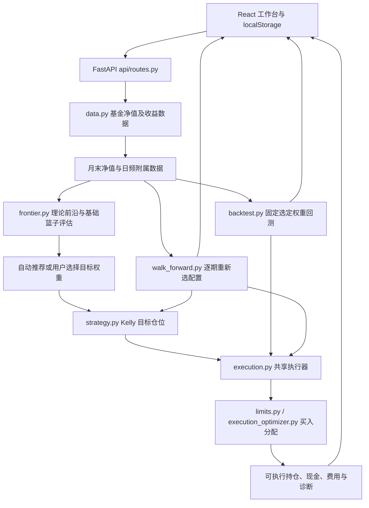

# Quant Compass 项目交接与算法、架构审查材料

> 核对日期：2026-08-31。用途：让接手者及量化投资、数值优化、软件架构专家在不了解项目历史的情况下，理解当前实现并进行独立 review。
>
> 本文包含代码事实、合成案例验证、初步审查意见及待验证事项。它不是外部专家已签署的审计报告，也不构成收益或风险保证。本次只新增本文，不修复算法、不改已有功能、不发送项目资料给外部专家。

## 1. 先读结论

**总体判断：分层设计值得保留，但不能据此认定策略已被证明有效，或实际账户满足界面设置的风险上限。**

项目已经形成“基础配置 → 战术仓位 → 固定资金流 → 受限执行 → 绩效评估”的完整研究工具雏形。理论目标与实际成交分离、推荐与 Kelly 回测共用执行器、显式退出及资金守恒检查，都是合理的工程选择。

不过，本次复核发现三项可直接复现的正确性问题：

1. Kelly 参考组合直接加权基金单位净值，改变某只基金的净值面值、而不改变其收益率，仍会改变参考组合收益。
2. 默认按缺口比例买入时，单基金超配与另一基金低配并存，会买过基金篮子的合计目标；跟踪优化分支的约束更严格，两条路径不一致。
3. 常规 Kelly 回测的单位净值记录在当期交易之前，期末净值、年化和回撤指标没有纳入最后一期交易费；最终资产金额本身已扣费。

另有重要模型与验证限制：未显式处理普通基金分红再投资；真实货币基金仍被纳入统一 Kelly 篮子；自动推荐点没有按用户的完整交易路径排名；完整滚动回测的选点规则与界面推荐规则不同。详见第 7 节。

现有测试本次实际运行：**后端 136 项通过，前端 17 项通过**。上述问题仍能复现，说明测试通过不能替代经济语义与独立账本审查。

## 2. 背景、目标与当前版本

### 2.1 项目要解决什么问题

Quant Compass 面向个人长期基金投资研究：用户给出基金池、已有持仓、闲置现金、每月新增预算、费用、申购限制和风险偏好，系统帮助回答：

- 理论上怎样组合基金，收益与波动之间如何取舍？
- 当前基金篮子应该配置多大仓位？
- 在不随意清仓、不突破预算及申购限制的前提下，本期具体买多少？
- 这种策略相对简单定投是否有证据支持，现金拖累和交易限制影响多大？

README 仍保留 Value Averaging、MA250、“实时建议”等历史表述。**当前默认算法是 Kelly 引导的固定预算 DCA，并不是按 VA 目标缺口无限追加资金。** 默认 Kelly 仓位不由价格/均线信号决定；均线主要用于展示，`legacy_linear` 才用它直接决定仓位。

目前主要数据路径是开放式公募基金净值和货币基金万份收益。虽然背景文档提到 ETF，不应理解为已实现完整的场内 ETF 价格、盘口、溢折价、整手交易及交易所费用模型。

### 2.2 代码快照与工作区边界

| 项目 | 本次核实结果 |
|---|---|
| 分支 | `codex/frontend-research-workbench-redesign` |
| HEAD | `03e6987`，2026-08-12，`fix: stabilize fund data and monthly execution` |
| 前端状态 | 已有未提交的工作台界面和回归测试修改；本文基于当前工作区，不只基于 HEAD |
| 既有未提交文件 | `frontend/src/App.css`、`App.js`、`PortfolioOptimizer.js`、`PortfolioOptimizer.regression.test.js`、`i18n/translations.js`、`index.css` |
| 其他既有未跟踪内容 | 若干 `.agents/skills/` 目录及 `skills-lock.json`；不属于本次交接文档新增 |
| 本次新增 | 根目录 `handoff_project.md` |

`QUANT_OPTIMIZATION_PLAN.md` 可了解历史动机，但包含先后阶段的状态混写，不能直接当作当前功能验收清单。`AGENTS.md` 中“主要逻辑在 main.py”的结构描述也已落后于实现：`main.py` 主要组装应用，业务编排在 `api/routes.py`。

### 2.3 已有功能与尚未具备的能力

| 能力 | 当前状态与边界 |
|---|---|
| 基金池与参数输入 | 支持基金代码、类别、费用、限额、替代关系、日期、现金和持仓；前端本地持久化 |
| 基础有效前沿 | 月收益估计、收益与协方差收缩、长仓及单基金上限、约 20 个候选点 |
| 自动推荐前沿点 | 使用基础篮子的滚动样本外指标筛选；可以没有合格点 |
| 当前操作建议 | 返回理论持仓、可执行持仓、费用、现金、限购及未投入原因 |
| 固定权重回测 | Lump Sum、DCA、Kelly+DCA；前端分别请求理想起点与实际起点 |
| 完整策略滚动评估 | 有独立 Walk-forward 路径、简单基准、窗口比较及协方差/执行分配消融 |
| 导出与诊断 | 组合报告导出、资产贡献/分类、执行诊断、中英文界面 |
| 自动交易 | 未实现；无券商/蚂蚁账户授权、真实订单或成交回报 |
| 实际可售状态 | 限额是用户输入的情景，不是渠道账户实时查询结果 |
| 多用户服务 | 未发现认证、用户隔离、后端持仓数据库、持久化任务系统 |
| 历史市场重建 | 未实现完整的历史申购限额、到账时间、基金分红事件和逐时点可得数据快照 |

`ValueInvesting.js`、`DualMovingAverage.js` 是遗留组件，当前 `App.js` 未挂载，组件引用的旧股票/策略地址也不在现有路由中；不要作为已交付功能介绍。

## 3. 必须保留的金融语义

### 3.1 三类资产不能混为一谈

| 概念 | 领域含义 | 当前代码行为 |
|---|---|---|
| 基金篮子 / risk assets | 参与配置的实际基金资产，不等于全是股票 | 除字面键 `RiskFree` 外的基金均进入该篮子；真实货基、债基也在内 |
| `RiskFree` | 有收益、近似零风险的独立资产袖套，不是闲置现金 | 保留兼容用的合成资产键；给定年利率时构造确定性净值，协方差设为零 |
| `Cash` | 无收益的闲置现金、预算和储备管理 | 单独记账，不参加前沿，不在实际账本中自动获得 `risk_free_rate` |

前端已移除旧合成 `RiskFree` 入口，并清理旧持仓；实际货币基金应使用真实代码。**给基金设置 `money_market` 类别不会使它自动变成代码中的 `RiskFree`。** 类别当前主要服务于展示与暴露归因，没有独立的类别风险预算。

历史字段 `equity_value`、`target_equity_ratio` 有时实际指整个基金篮子；真正股票名义暴露用 `equity_exposure` 区分。这里的类别暴露来自用户标注，不是基金底层持仓穿透。

### 3.2 理论、执行和资金流

- `weights`：选定的理论配置；执行限购不得反向改写它。
- `target_holding` / `ideal_holding`：理论目标金额；`executable_holding`：买卖和费用后的实际模拟金额。
- `monthly_budget` / `monthly_investment`：本期新增外部资金；不等于本期一定全部投入基金。
- 默认不动用全部历史闲置现金追赶目标，也不自动卖出超配的普通基金；由未来新增资金逐步纠偏。
- 权重为零通常是 `NO_NEW_BUY`；只有显式 `exit_fund_codes` 且目标为零才卖出。替代买入可标记 `ACTIVE_SUBSTITUTE`。
- `reuse_settled_sale_proceeds` 默认关闭；开启仅是情景开关，不代表已经有真实结算日引擎。
- 分析范围外的正权重必须报错。推荐和执行器检查范围外正持仓；完整 Walk-forward 也检查。常规回测初始持仓的校验覆盖仍应继续审计。

相关入口：`core/portfolio.py:33`、`core/classification.py:18`、`core/execution.py:70`、`api/routes.py:180`。本文 `core/`、`api/` 均位于 `backend/` 下。

## 4. 架构、数据流和接手入口



上图中的两条回测路径是不同实验，不能因共享执行器就认为评估的是同一决策规则。

| 文件 | 责任及建议阅读点 |
|---|---|
| `backend/main.py` | FastAPI、CORS、全局 requests 超时补丁、`/api` 路由、静态站点挂载 |
| `backend/api/models.py` | 三类业务请求及限额模型；请求默认值与兼容参数 |
| `backend/api/routes.py` | 数据拉取、前沿选点、目标计算、执行编排、响应格式；较多业务职责集中于此 |
| `backend/core/data.py` | AKShare/东财适配、重试、货基缓存、净值对齐、管理费情景 |
| `backend/core/portfolio.py` | 权重校验、RiskFree 拆分、集中度边界、收益收缩 |
| `backend/core/frontier.py` | 协方差估计、SLSQP 前沿、基础篮子 Walk-forward、协方差消融 |
| `backend/core/strategy.py` | Kelly、仓位上下界、CVaR/回撤约束、窗口诊断及旧线性策略 |
| `backend/core/execution.py` | 唯一共享月度执行入口、显式退出、现金/RiskFree 结算、资金守恒 |
| `backend/core/limits.py` | 日限额折月限额、按缺口比例分配和余量再分配 |
| `backend/core/execution_optimizer.py` | 替代资格结构校验、执行协方差、跟踪误差优化及降级 |
| `backend/core/backtest.py` | 三种固定权重情景回测、可选策略前沿模拟 |
| `backend/core/walk_forward.py` | 扩展训练窗、逐期选点、独立持仓账本、基准和消融 |
| `backend/core/risk.py` | 净值回撤、经验 CVaR、样本可信度和资产诊断 |
| `frontend/src/PortfolioOptimizer.js` | 主工作台，输入状态、请求、图表和建议展示集中于一个较大组件 |
| `frontend/src/AssetDiagnosticsPanel.js` | 资产诊断展示 |
| `frontend/src/exportPortfolioReport.js` | 导出报告 |
| `backend/tests/` | 算法、资金流、费用、限额、分类、API、Walk-forward 和独立账本测试 |
| `analysis/independent_backtest_audit.py` | 既有独立审计辅助脚本；不等于本次已运行真实基金审计 |

### 4.1 API 契约概要

| POST 地址 | 主要输入 | 主要输出 / 注意点 |
|---|---|---|
| `/api/fund_names` | 基金代码 | 名称映射 |
| `/api/analyze` | 基金池、历史区间、费用、类别、替代关系、风险参数 | 前沿、自动推荐索引、推荐筛选原因、基础篮子 OOS 指标、诊断；可选策略前沿默认关闭 |
| `/api/current_recommendation` | 选定权重、当前持仓与现金、月预算、限额和策略参数 | 最新月频信号、目标/实际操作、资金去向及未投入原因；不是下单接口 |
| `/api/backtest_strategies` | 选定权重、历史区间、起始资产、预算和约束 | 三种固定权重回测；`include_walk_forward=true` 时附加完整策略滚动评估 |

前端“理想起点”将同一初始总资产按选定权重重分配，“实际起点”保留输入持仓和 Cash。这里的实际起点只是把用户输入金额放到历史起点的反事实情景，**并非从真实历史成交记录重建账户**。

### 4.2 数据处理事实

1. 普通基金调用 `fund_open_fund_info_em(..., indicator="单位净值走势")`。没有接入分红再投资总回报序列或分红现金流。
2. 货基从东财万份收益字段生成净值：`daily_return = income_per_10k / 10000`，再累计复利。该模型假定收益可连续再投资，未建真实份额确认及收益结转规则。
3. 月频用 `resample("ME").last()`；共同样本从各基金都有数据的时段开始，再 `ffill().dropna()`。替代基金也先参加数据拉取和交集处理，短历史替代品可能缩短整个研究区间。
4. 日频净值存于 DataFrame 的 `attrs["daily_nav"]`，用于尾部风险和回撤。混合货基日历日与普通基金交易日时，索引可能包含周末；“21 行”不能无条件等同于 21 个交易日。
5. `apply_fund_fees_to_history=false` 为默认，避免对通常已体现运作费用的基金净值重复扣费；开启后只额外处理月频序列，日频风险输入仍来自原始数据，应审计口径一致性。
6. 基金列表为进程内缓存；货基净值缓存 TTL 为 6 小时。没有统一、持久化、可版本追溯的市场数据快照。
7. 推荐取最近约 10 年数据，但最终信号来自过滤后的月末序列；月中通常只能使用上一个完整月的点。响应有 `latest_nav`，未统一提供信号日期和逐基金数据新鲜度。不要将其称为实时交易信号。

数据源字段语义可对照 [AKShare 公募基金文档](https://akshare.akfamily.xyz/data/fund/fund_public.html)。这里确认的是代码取数方式；本次没有逐只基金核对真实分红和净值复权情况。

## 5. 核心算法：从估计到买入

### 5.1 第一步：构造收缩均值—方差有效前沿

记基金月末净值为 `P[t,i]`，月收益为 `r[t,i] = P[t,i]/P[t-1,i] - 1`。

当前实现使用 `pct_change().fillna(0)`，首个无收益观测被填为 0，也参与均值和协方差估计。对普通基金：

```text
mu_raw[i] = mean(r[:,i])
mu[i] = 0.65 * mu_raw[i] + 0.35 * mean(mu_raw[非 RiskFree 基金])
Sigma = 0.80 * sample_cov(r) + 0.20 * diag(sample_cov(r))
```

`RiskFree` 的均值不做上述收缩，其方差及协方差置零。默认 `fixed_20` 是固定向对角阵收缩；可选 `ledoit_wolf` 是另一种向标量单位阵收缩的估计，不应把两者混称为同一模型。

对每个候选月期望收益 `q` 求解：

```text
minimize    w' Sigma w
subject to  sum(w) = 1
            mu' w = q
            0 <= w[i] <= cap[i]
```

通常非 RiskFree 单基金上限 50%；仅一只资产时允许 100%；RiskFree 可为 100%。因此，只有两只普通基金且无 RiskFree 时，约束会强制 50/50，有效前沿会退化，不能宣传仍存在丰富的配置选择。

SLSQP 先找最小方差点，再向最大可行收益取 20 个等距目标；使用多个初值。小于 1% 的权重可能清零重归一化，若会破坏上限则保留原权重。单基金有专门分支。

输出的年化估计为：`return = 12 * mu'w`，`risk = sqrt(12 * w'Sigma w)`。这不是收益承诺，也不是回测 CAGR。当前风险坐标用原始优化权重，而收益和返回权重用清理后权重，存在小幅口径不一致（第 7 节 A10）。

合理性判断：长仓、集中度限制和收缩用于缓和小样本敏感性，有合理依据；但固定 35%/20% 没有在本文中获得最优性证明。协方差收缩的研究依据可参考 [Ledoit 与 Wolf 原文](https://ledoit.net/honey.pdf)，不能据此推导本项目这两个常数最优。SLSQP 能表达这些约束，见 [SciPy 1.16.1 文档](https://docs.scipy.org/doc/scipy-1.16.1/reference/optimize.minimize-slsqp.html)。

代码：`core/frontier.py:26,118`；`core/portfolio.py:76,157`。

### 5.2 第二步：基础前沿的自动选点

`calculate_frontier_walk_forward_metrics` 从 24 个月训练样本开始，逐月扩展训练集、重算训练期前沿，按前沿序号的相对位置匹配候选点，用下一月基金收益加权形成 OOS 序列。

这条路径：**没有真实持仓路径、月预算、交易费、限购、替代执行或 Kelly 仓位控制**。它评价的是一个按前沿相对位置选基础配置的规则，而不是“现在返回的这组固定权重从过去一直持有”的表现。

自动推荐默认先过滤：OOS 至少 12 个月、最大回撤不超过输入阈值、开启时 CVaR 不超限、权重稳定性至少 0.5，且 Sharpe 有限。随后依次按 OOS 超额 Sharpe、稳定性、较低理论风险排序。无合格点返回空推荐；12–23 个月标记有限信心。

稳定性定义约为 `1 - mean(0.5 * ||历史训练权重 - 当前全样本权重||_1)`。它用到了最终全样本权重作为比较锚，只能作为事后稳定性诊断，不能声称是历史当时已知的稳定性指标。

注意：这里的回撤筛选始终传入 `max_drawdown_limit`，未随 `enable_drawdown_constraint=false` 关闭；该开关只在部分其他路径生效。CVaR 筛选也未复用 Kelly 的“尾部样本不足则不执行硬约束”逻辑。

代码：`core/frontier.py:393`、`api/routes.py:88,247,272`。

### 5.3 第三步：Fractional Kelly 决定篮子总仓位

先拆分选中权重：`b = sum(w[非 RiskFree])`，篮子内相对权重 `v[i] = w[i]/b`。

当前参考净值是 `N[t] = sum(v[i] * P[t,i])`。这不是按初始金额权重构造的净值，也不是恒定权重组合收益累计值，其缺陷见 A1。

对参考净值取截至信号日最近 `estimation_window` 个月收益：

```text
rf_month = (1 + risk_free_rate)^(1/12) - 1
mu_excess = mean(reference_returns) - rf_month
sigma2 = max(sample_variance(reference_returns), 1e-6)
full_kelly = mu_excess / sigma2
fractional_kelly = kelly_fraction * full_kelly
cash_cap = clip((wealth - minimum_cash_reserve) / wealth, 0, 1)
upper = min(max_weight, cash_cap, 历史风险检验允许的最大比例)
lower = min_weight if upper >= min_weight else 0
tactical_ratio = clip(fractional_kelly, lower, upper)
target_fund_ratio = b * tactical_ratio
target_holding[i] = wealth * target_fund_ratio * v[i]
```

少于 3 个实际月收益观测时有保守起始分支，未完成正常风险网格检验。请求的窗口虽至少 6 个月，代码并不保证每次有足够满窗数据。

**这是一维均值/方差 Kelly 近似加截断与历史风险筛选，不是直接最大化全组合期望对数财富，也不是论文中的概率回撤约束 Kelly 求解器。** 当估计超额收益为负、但风险上界容许时，默认最小仓位 30% 仍会强制维持正目标；这是投资政策选择，应明确给用户。

若所选理论组合已有 RiskFree，最终风险仓位又乘以 `b`，会再降一次。例如基础非 RiskFree 比例 60%、战术比例 50%，最终基金篮子目标是 30%，不是 50%。这可能是有意政策，但需要专家判断是否重复降低风险敞口。

代码：`core/strategy.py:227`、`api/routes.py:412,551`、`core/backtest.py:302,430`。

### 5.4 CVaR、回撤和现金约束到底约束什么

默认参数见下表。对候选比例 `a`，风险层构造假想收益：

```text
R_portfolio = a * R_basket + (1-a) * R_risk_free
CVaR = max(0, 最差 ceil(n*(1-confidence)) 个收益的平均损失)
MDD = 初始净值 1 加入后，累计净值相对历史峰值的最大损失
```

在 0 到允许上界之间以 0.005（0.5 个百分点）为步长扫描，取同时满足启用条件的最大比例，再截断 Kelly。上界是有限网格的历史压力检验结果，不是未来账户损失的数学保证。

优先用日频净值构造 21 行滚动收益作 CVaR、用日频路径作回撤；无日频时降级月频。重叠收益的有效观察数按 `ceil(n/horizon)` 粗略折算；有效尾部少于 5 时 CVaR 只警告、不作为硬约束。该折算是启发式，不是统计独立性证明。

月均值/方差只取最近指定月窗；日频 CVaR 和回撤使用截至信号日的全部传入历史，**没有同步截成 36 个月**。这可能使近期收益与很久以前的风险事件共同决定仓位，需要明确是政策还是遗漏。

只有当非篮子部分真的全部持有对应 RiskFree 时，上面的风险混合才与该目标匹配。API 若传了正 `risk_free_rate`、却选择零 RiskFree 权重而把余款留 Cash，风险估计仍给非篮子部分加利息；实际 Cash 账本并未计息。这是风险估计与现金语义不一致的条件性问题。

即使目标合格，执行器不强制减仓；实际暴露可能高于目标，储备也可能因原账户无流动性而无法补足。[Busseti、Ryu、Boyd 的 Risk-Constrained Kelly 原文](https://web.stanford.edu/~boyd/papers/kelly.html)讨论的是概率回撤限制；不能把本项目的历史最大回撤过滤等同于那类保证。

| 参数 | 当前默认 | 解释 |
|---|---:|---|
| `strategy_mode` | `optimized_kelly` | 兼容 `legacy_linear` |
| `kelly_fraction` | 0.5 | 分数 Kelly 系数 |
| `estimation_window` | 36 月 | 月度收益与方差窗口 |
| `min_weight` / `max_weight` | 0.3 / 0.8 | 推荐、固定回测和前端默认；analyze API 可为空 |
| `minimum_cash_reserve` | 0 | 金额，不是比例 |
| `cvar_confidence` / `cvar_limit` | 0.95 / 0.08 | 对指定期限经验损失的阈值 |
| `risk_horizon_days` | 21 | 允许 5–63；实际按净值序列行数计算 |
| `max_drawdown_limit` | 0.20 | 历史路径损失阈值 |
| `ma_window` | 12 月 | 不是固定 250 个日观测 |
| `planned_purchase_days` | UI 默认 1 | API 未给时用月内工作日数量折限额 |
| `apply_fund_fees_to_history` | false | 不额外扣管理费 |

### 5.5 第四步：固定资金流和受限买入

`execute_monthly_plan` 先处理显式退出及卖出费，再形成预算。合计目标大于当前篮子金额时，新增月预算可以参与买入；否则通常不买。可复用卖出净款取决于开关；同时计算现金储备下的可用流动性。

没有替代关系时，API 默认使用 `proportional_gap`：只向正权重、正缺口基金买入，按缺口比例分配，扣除含费占用，碰限额后向剩余基金重新分配。这里缺少合计净买入缺口上限，见 A2。

有替代关系时，API 使用 `constrained_tracking`。替代基金必须在分析池中、不能自指或形成替代链、战略权重必须为零；主基金限购约束真正阻碍买入时才激活。**代码只验证关系结构，没有自动验证替代品是否跟踪同一指数、相同币种或相近风险。**

记卖出后持仓金额为 `h`、目标为 `t`、含费买入金额为 `x`、买入费率为 `f`、执行协方差为 `Sigma_e`，求解约为：

```text
post = h + x / (1+f)
d = (post-t) / max(sum(h), sum(t), 1)
minimize    d' Sigma_e_scaled d
subject to  x >= 0
            sum(x) <= 可用买入预算
            sum(x/(1+f)) <= max(sum(t)-sum(h), 0)
            x[i] <= 申购限额
            主基金 x[i] <= 正目标缺口[i] * (1+f[i])
            不合资格资产 x[i] = 0
            sum(x) >= 经合计缺口缩放后的可行比例基线投入额
```

执行协方差按最近月收益估计，先对称化并裁剪负特征值，再缩放数值量级。费用通过含费预算进入约束，目标函数没有单独的费用惩罚项、收益项或跟踪偏差均值项；协方差奇异时可能有多解。主基金—替代基金之间也没有逐组替代金额上限，只有资格门槛和全局约束。

基线投入下限是近期修复的重要设计：避免求解器仅因跟踪误差改善很小而取消本来可行的 DCA。缺协方差或求解失败会降级比例分配，但降级也会继承 A2，不能说所有分支都有同样的约束保证。

交易后检查：

```text
期初基金 + 期初 RiskFree + 期初 Cash + 外部新增资金 - 交易费用
    = 期末基金 + 期末 RiskFree + 期末 Cash
```

允许误差为 `1e-6` 金额单位。资金守恒非常必要，但**守恒不能证明目标仓位、储备或风险预算也满足**。

限额 `min(日限额 × 计划购买天数, 月限额)` 是情景近似。未给购买天数时用普通周一至周五数量，不识别中国节假日、境外休市或实际申购窗口。月度累计购买额度也不等于建议当天能买的额度。

代码：`core/execution.py:70,170`、`core/limits.py:14,73`、`core/execution_optimizer.py:226,389`。

## 6. 回测与策略有效性证据

| 实验路径 | 配置从哪里来 | 交易与时间约定 | 能说明什么 |
|---|---|---|---|
| 固定权重 Lump Sum / DCA | 请求传入权重 | 独立简化账本；未传入交易费/申购限额；Lump Sum 提前投入全部未来月预算 | 展示融资时点不同的情景，不能当完全公平的策略增益检验 |
| 固定权重 Kelly+DCA | 请求传入权重，通常是全样本前沿选点 | 使用前一期信号、当期月末净值交易；调用共享执行器 | 给定配置与起点的历史模拟；配置本身可能含事后选择 |
| 基础篮子前沿 OOS | 每月训练期前沿相对序号 | 直接加权下一月收益，无成交账本 | 基础配置规则诊断和当前自动推荐筛选 |
| 完整可执行 Walk-forward | 每月按训练期理论超额 Sharpe 重新选点 | 信号期价格成交、下一月计收益；共用执行器 | 动态配置加 Kelly/DCA/约束的联合效果，但不等同于当前界面选点规则 |

完整 Walk-forward 默认 24 个月起训，扩展训练窗；比较 `equal_weight_dca`、`fixed_weight_dca`、`no_kelly`、`full_strategy`。其中 fixed weight 是首次训练选中的配置，**不是 API 请求中的用户选定权重**；`no_kelly` 仍有 `max_weight` 及现金上限，因此不是无任何仓位限制的纯满仓基准。

24/36/48/60 月 Kelly 窗口比较使用共同的较晚起评点；还有可选 Ledoit–Wolf 和比例分配消融，结果标记 `auto_switched=false`。不同面板起评时间、外部资金次数可能不同，不能只比较最终金额。

完整评估有相同起始资产/外部资金流约定、单位化会计、执行偏差、费用、未投入预算等诊断，是值得保留的基础。但仍存在：

- 完整 Walk-forward 没有接收用户 `weights`、`strategy_mode`、显式退出清单及卖出款复用开关，因此不能用它来直接认证每种当前请求配置。
- 基础 OOS 用算术平均超额收益年化计算 Sharpe；完整 Walk-forward 用几何年化收益减年无风险利率，再除年化波动。两者不应无标签横比。
- 普通回测最大回撤返回负数；风险上限及完整 Walk-forward 多用正的损失幅度。前端和导出必须明确符号。
- 无下一月收益泄漏不等于可实际成交。完整评估在看到信号期净值后仍用该期净值成交；公募净值发布时间、申购截止时间及 QDII 滞后尚未建模。
- 多个前沿点、窗口与模型在同一历史区间比较并择优，会产生选择偏差；需要锁定规则后再在未参与选择的外层样本验证。
- 风险约束可用日频输入，但实际策略绩效主要按月记账；月度最大回撤会漏掉月内路径。

代码：`api/routes.py:893`、`core/backtest.py:35,98,200`、`core/frontier.py:393`、`core/walk_forward.py:221,273,443`。

## 7. 初步审查发现与处理优先级

优先级表示建议处理顺序。P1 表示影响金额、金融语义或主要结论；P2 表示重要的可靠性、统计口径或维护问题。以下不将建模偏好冒充代码 bug，也不因测试通过就认定问题不存在。

### 7.1 算法与数据

| ID / 级别 | 事实、影响及证据 | 建议与验收方式 |
|---|---|---|
| A1 / P1，已复现 | `api/routes.py:412`、`backtest.py:302`、`walk_forward.py:666` 直接做 `NAV.dot(weights)`。A 涨 10%、B 跌 10%，50/50 参考收益为 0%；仅把 B 净值乘 10，结果变成 -8.1818%，而各基金收益率完全未变。会改变 Kelly 与风险估计。 | 明确参考篮子是恒定金额权重还是固定份额。恒定权重应聚合逐期收益；买入持有应按起点净值换算份额。加净值缩放不变性测试，三个调用处共用实现。单纯起点归一化只解决面值问题，不等于恒定权重再平衡。 |
| A2 / P1，已复现 | A 当前 800、B 当前 0，目标各 450，新预算 200。默认比例分配给 B 买 200，篮子最终 1000 > 目标 900；跟踪分支只买 100。两个结果资金守恒均通过。证据 `execution.py:170`、`limits.py:73`、`execution_optimizer.py:404`。 | 合计缺口上限必须成为正常、替代与降级路径的公共不变量；增加“一个超配、一个低配”及求解失败/缺协方差回归。 |
| A3 / P1，已复现 | 固定 Kelly 回测在 `backtest.py:340` 先记单位净值，交易后未更新，`:550` 用最后一个交易前净值算绩效。平价资产、初仓 100、两期各投 100、买入费 10% 的放大示例：期末资产 281.8182 正确，但返回单位净值 0.954545，期末费后单位净值应为 0.924716。 | 先按交易前净值发行外部资金对应份额，再以交易后财富记期末净值；加入末期手续费、显式退出费、首期费的独立核算测试。10% 仅为测试放大参数，不代表现实费率。 |
| A4 / P1，代码确认，真实影响待量化 | `data.py:222` 附近只取单位净值，账本不记录分红。遇现金分红或份额折算，价格变化可能被误当总回报变化，影响前沿、Kelly、尾部风险和回测。 | 使用经过验证的复权总回报序列，或显式记录分红/份额变化及再投资。不能简单把累计净值当复权总回报。用真实分红公告和净值样本对账。 |
| A5 / P1，代码确认，需产品决策 | 所有非 RiskFree 基金同乘战术比例，类别仅归因；真实货基/债基没有独立安全资产配置政策。`classification.py`、`portfolio.py:60`、`routes.py:551`。这不等于它们方差被设成相同，但意味着都受同一个总仓位开关控制。 | 先确定“安全资产袖套”和“参与择时篮子”的资产资格规则，再讨论类别风险预算；保留 Cash 独立。不要仅靠改名宣称问题已解决。 |
| A6 / P1，已复现边界 | 现有 1000 基金、目标 100、现金 0、预算 0、储备要求 100，执行器仍保留基金 1000、现金 0，不卖出。是“不自动减仓”与“实际硬上限”的冲突，不是守恒错误。 | 明确产品是目标引导工具，还是能主动降风险的再平衡器。至少输出实际超限、储备缺口和不可行原因；如允许减仓，另建授权明确的减仓政策。 |
| A7 / P1，代码确认 | 自动推荐评价基础篮子；完整评估另选训练期最大 Sharpe 点，不使用用户选中权重或同一选点规则。不能声称当前推荐经过完整可执行样本外认证。`routes.py:247`、`walk_forward.py:443`。 | 统一明确的 SelectionPolicy，在外层测试期间只使用此前数据选点；让推荐、固定情景、动态策略评估分别标注范围。 |
| A8 / P2，代码确认 | Kelly 少量收益观测可进入估计；有效尾部不足则 CVaR 降级；日频窗口与月频窗口不同、日历频率可能混杂。基础推荐的 CVaR 过滤没有相同可信度门槛。 | 返回实际窗口、最后数据日、频率及有效样本；验证 36/60 月不足尾部时策略采取何种保守行为。统一风险日历和各入口开关语义。 |
| A9 / P2，条件性模型不一致 | 非 RiskFree 余额可能是 Cash，但风险层仍用 `(1-a)*rf`；最终比例还乘基础篮子比例，且最小仓位可覆盖负 Kelly。`strategy.py:190,346`、`routes.py:551`。 | 对完整三桶目标计算风险；将无风险资产收益、比较基准利率、Cash=0 分开参数化。分别消融最小仓位和两层风险缩放。 |
| A10 / P2，代码确认 | 首期零收益参与估计；两普通基金受上限限制退化为 50/50；风险与清理后权重不完全一致；两种 Sharpe 定义不同。 | 对外解释退化情形，剔除无收益观测；输出原始/展示权重或统一重算指标；统一指标定义并记录计算元数据。 |
| A11 / P2，代码确认与待测风险 | 替代资格只校验关系结构；全局协方差目标不约束每组替代量，也不单独惩罚成本/偏差均值。求解成功后缺少统一的所有约束残差检查。 | 用户确认指数/资产类别/币种等替代依据；必要时加入替代组上限。测试病态协方差、低波资产、极端费率、数值尺度及降级后的约束。 |

### 7.2 软件架构与工程

| ID / 级别 | 已核实事实与风险 | 建议 |
|---|---|---|
| E1 / P1（对外部署前） | `main.py` 无认证，CORS 通配，启动脚本监听 `0.0.0.0`；暴露范围取决于主机网络和防火墙。本次未做公网暴露测试。 | 本地工具默认绑定回环地址；如要共享，再明确认证、访问范围、CORS、请求限额及错误信息政策。不要直接当多用户金融服务部署。 |
| E2 / P2 | `async def` 路由内直接调用同步 AKShare/requests、`time.sleep` 和 CPU 密集前沿循环；前端并发请求不能使这些工作自动并行。 | 短期隔离同步 I/O，CPU 重计算移出事件循环；先测端点延迟与取消行为，再决定进程池/任务队列。参见 [FastAPI 官方并发说明](https://fastapi.tiangolo.com/async/)。 |
| E3 / P2 | 多处重复计算前沿、重复拉取净值；进程内缓存不能支持完整审计；`DataFrame.attrs` 隐式传递日频数据。 | 用显式数据快照对象保存月/日数据、来源、日期、对齐/费用政策和哈希；相同输入复用结果，避免比较实验使用不同数据版本。 |
| E4 / P2 | 路由包办大量目标计算与响应组装；前端主组件集中状态、请求和图表；core 的部分校验依赖 FastAPI HTTPException；响应主要是未建模字典。 | 抽应用服务层和明确请求/响应/领域结果类型，core 使用领域异常，API 统一转换；前端按配置、请求、图表和建议拆分。保留当前单体，无需先拆微服务。 |
| E5 / P2，代码确认 | Dockerfile 及 README 部分安装命令引用 `backend/requirements.txt`，该文件在当前工作区不存在。启动脚本还执行 AkShare 升级，与锁定环境目标冲突。 | 统一 `pyproject.toml + uv.lock` 安装链；Docker 和文档采用同一来源，数据适配器更新独立于正常启动。Docker 本次未构建，缺文件已静态确认。 |
| E6 / P2 | 金额、权重、日期和费用约束分散在 Pydantic/core；部分浮点只检查大小，缺少显式有限值与完整区间校验；错误直接返回 `str(e)`。 | 明确拒绝 NaN/Inf、负金额、非法费率和无效日期；校验在入口与执行不变量处集中，区分可展示错误与内部诊断。 |
| E7 / P2 | localStorage 是浏览器本地配置存储；无后端版本化分析记录、历史参数快照和数据质量审计日志。 | 保留便捷本地模式，增加可导出的输入/结果/版本快照与迁移版本；如需账户级持久化，再引入轻量数据库。 |

架构建议是按职责继续整理当前模块化单体。没有证据表明现阶段需要微服务、复杂消息中间件或更复杂择时模型；先消除会计、数据和评估链路不一致更有价值。

## 8. 本次验证记录与可复现案例

### 8.1 实际运行记录

环境：Windows / PowerShell，项目既有虚拟环境 Python **3.13.12**、NumPy **2.3.2**、Pandas **2.3.1**、SciPy **1.16.1**、AKShare **1.17.19**。项目声明最低 Python 3.11，不代表本次使用的是 3.11。

| 检查 | 实际结果 | 解释 |
|---|---|---|
| 后端 `python -m pytest tests -q -p no:cacheprovider` | 136 passed，70.20 秒 | 使用项目 `.venv`；首次被沙箱阻止启动，获准使用现有环境后完成；未升级依赖 |
| 前端 `CI=true npm test -- --watchAll=false --runInBand` | 4 suites / 17 tests passed，45.277 秒 | 覆盖当前未提交前端改动 |
| 合成只读案例 | A1、A2、A3、A6 复现 | 未改业务代码；未把新案例伪装成已有回归测试 |
| 行情数据及真实策略优越性 | 未验证 | 没有冻结真实基金池、实际费用、历史约束和外层留出集 |
| 前端生产构建、浏览器操作、Docker 构建、部署负载 | 本次未执行 | 本次是交接与审阅，不是发布验收 |
| pre-commit | 本次未执行 | 未安装在本项目虚拟环境；未提交 PR，未运行会自动格式化现有代码的全仓检查 |

测试目录已有有价值的独立账本、现金/RiskFree、费用透支、限额、风险频率与无下一期收益泄漏测试；但覆盖会计守恒不等于覆盖所有期末指标，覆盖训练切分不等于覆盖成交可得性。

### 8.2 运行既有测试

从项目根目录进入对应目录，在已配置好的环境运行：

```powershell
Set-Location backend
.\.venv\Scripts\python.exe -m pytest tests -q -p no:cacheprovider
```

```powershell
Set-Location frontend
$env:CI = 'true'
npm.cmd test -- --watchAll=false --runInBand
```

两段命令分别从根目录开始，不是连续执行。新环境可在 `backend` 执行 `uv sync --extra test`，前端执行 `npm.cmd ci`。正常启动用根目录 `start.cmd` 或 `./start.ps1 -SkipAkshareUpdate`；启动会构建并更新静态资源，不是本次验证所需步骤。

### 8.3 最小审查复现代码

以下 Python 在 `backend` 为工作目录时执行，无市场联网依赖。可以复制到临时文件运行，或用 PowerShell 单引号 here-string 通过 `| .\.venv\Scripts\python.exe -` 输入。打印的是当前行为，修复后预期发生变化。

```python
import numpy as np
import pandas as pd
from core.execution import execute_monthly_plan
from core.backtest import backtest_kelly_dca

# A1：收益率未变，仅改变 B 净值面值。
prices = pd.DataFrame({"A": [1.0, 1.1], "B": [1.0, 0.9]})
weights = pd.Series({"A": 0.5, "B": 0.5})
rescaled = prices.copy()
rescaled["B"] *= 10
print(prices.dot(weights).pct_change().iloc[-1])       # 0.0
print(rescaled.dot(weights).pct_change().iloc[-1])     # -0.08181818...

# A2：正向个体缺口不等于篮子合计缺口。
inputs = dict(
    fund_codes=["A", "B"], current_holdings={"A": 800, "B": 0},
    target_holdings={"A": 450, "B": 450},
    target_weights={"A": 0.5, "B": 0.5},
    current_cash=0, monthly_budget=200,
    buy_fees={}, sell_fees={}, investment_limits={}, timestamp="2026-08-31",
)
cov = pd.DataFrame(np.eye(2), index=["A", "B"], columns=["A", "B"])
for method in ("proportional_gap", "constrained_tracking"):
    result = execute_monthly_plan(
        **inputs, allocation_method=method, execution_covariance=cov
    )
    print(method, result.total_gross_buy,
          sum(item.executable_holding for item in result.funds.values()))
# proportional_gap: 200, 1000；constrained_tracking: 100, 900。

# A3：平价基金、两期申购，放大交易费以清楚展示期末指标差异。
nav = pd.DataFrame({"A": [1.0, 1.0]},
                   index=pd.to_datetime(["2026-01-31", "2026-02-28"]))
result = backtest_kelly_dca(
    nav, {"A": 1.0}, 100, initial_holdings={"A": 100},
    min_weight=1, max_weight=1, buy_fee={"A": 0.1},
    enable_cvar_constraint=False, enable_drawdown_constraint=False,
)
first_post_fee_nav = (100 + 100 / 1.1) / 200
final_units = 200 + 100 / first_post_fee_nav
correct_final_nav = (100 + 200 / 1.1) / final_units
print(result["final_value"], result["final_unit_nav"], correct_final_nav)
# 281.8181818, 0.95454545, 0.92471591。

# A6：无新增资金且没有主动减仓授权，目标和储备不可能自动兑现。
result = execute_monthly_plan(
    fund_codes=["A"], current_holdings={"A": 1000},
    target_holdings={"A": 100}, target_weights={"A": 1},
    current_cash=0, monthly_budget=0, minimum_cash_reserve=100,
    target_cash=900, buy_fees={}, sell_fees={}, investment_limits={},
    timestamp="2026-08-31",
)
print(result.funds["A"].executable_holding, result.cash_after,
      result.total_gross_sell)  # 1000, 0, 0。
```

## 9. 建议实施顺序与专家应回答的问题

### 9.1 最小风险的后续路线

1. **先锁定输入与正确性基线。** 保存本版、数据样本及测试结果；为 A1/A2/A3 写独立不变量与账本回归；分开修复，不同时调整统计参数。
2. **修正数据经济语义。** 明确普通基金总回报、分红再投资、货基结转、日期日历及费用口径；给所有报告附数据截止日与来源。
3. **明确投资政策。** 决定 Cash、真实货基、RiskFree、债基分别如何参与 Kelly；明确最小仓位、是否允许主动减仓、储备不足如何处理。没有用户明确政策，不应直接扩大自动卖出范围。
4. **统一评估策略身份。** 固定权重情景、基础篮子推荐、完整动态策略采用可识别的不同策略 ID；如果声称检验当前推荐，就把相同选点规则、成交时间和执行约束接入外层留出评估。
5. **证明增量价值再增加复杂度。** 在冻结基金池、相同外部资金与费用下，比较等权、固定权重、去 Kelly、完整策略；报告完整路径、区间不确定性、费用、现金占用和约束违例。现有窗口及协方差消融可继续使用，但不应直接据最高历史收益自动切换。
6. **最后完善应用边界。** 整理领域服务、数据快照、响应模型、任务执行及前端拆分；修复 Docker 依赖链与监听默认。无需先改成微服务。

### 9.2 交给专家的 review brief

请专家不要仅判断公式是否“常见”，而应逐项给出结论、证据、反例和最小修改建议：

| 审查维度 | 希望专家明确回答 |
|---|---|
| 投资目标 | 本工具到底优化长期对数增长、风险调整收益、资金投入纪律，还是跟踪某个目标配置？不同层的目标是否冲突？ |
| 参考组合 | 恒定权重收益、起点归一化买入持有、实际持仓收益，哪个才是 Kelly 应估计的对象？ |
| 两层优化 | 均值—方差配置再乘一维 Kelly 是否合理？已有 RiskFree 权重再缩放是否重复控制？ |
| 低风险资产 | 真实货基和债基应否与股票/黄金共用一个战术开关？如何保持 Cash 独立且避免虚构收益？ |
| 风险约束 | 历史 CVaR/MDD 与实际不卖出的执行政策是否兼容？尾部样本不足时应暂停、收紧还是警告继续？ |
| 交易机制 | 日限额折月限额、T+N 到账、基金截止申购时间、赎回费分档、替代资格，哪些必须进入第一版模型？ |
| 统计证据 | 推荐点筛选、窗口比较和消融应如何嵌套，才能控制多重选择与事后择优偏差？需要多少有效历史样本？ |
| 架构适配 | 对单用户本地研究，当前模块化单体是否足够？哪些职责必须抽离才能使同一策略在建议与回测中一致？ |
| 验收标准 | 哪些问题阻止将输出用于真实资金决策，哪些只影响研究精度？什么可复现实验能证明修复有效？ |

建议专家输出：**明确不合理或错误之处 → 可接受但须披露的假设 → 尚无证据的优越性主张 → 按优先级的修改建议与验收案例**。保留不同意见，不默认维护现有算法，也不为追求复杂度而推倒已验证的执行账本。

本文的模型研究链接和工具文档只用于解释方法及语义；本项目是否适合实际资金决策，仍需要在修复正确性问题后，以可追溯数据、真实约束和独立留出评估来判断。
